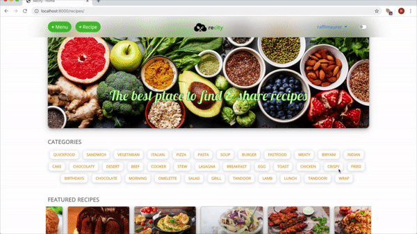

# Recipe Web App

A web application that provides users a way to share and discover new recipes. This application was targeted towards casual users and food enthusiasts alike.

The application is targeted at people looking to manage their recipes. Recipe management is challenging, with people storing their collections in handwritten form or platform-specific applications. By virtue of being web-based, this application provides a platform-agnostic way of easily storing recipes to be accessed from anywhere on any device.

A full demo of the web application can be found here: https://youtu.be/Lcw65lYQdwE. Full credit goes to Raffi Maurer for this video.

## Installation

Using pip install virtualenv: ``pip install virtualenv``

Create a virtual environment using virtualenv (at the project root): ``virtualenv recipe-virt``.

cd to: ``recipe-virt\Scripts`` on Windows __or__ `recipe-virt/bin` on Linux

Run the Virtual Environment: ``activate`` on Windows __or__ ``source activate`` on Linux

Pip install all the required libraries: ``pip install -r requirements.txt``

## Usage

To start the app : ``python manage.py runserver``

## Guide to files inside /recipes

**admin.py**	Changes to Django admin interface

**apps.py**		Configure app + sub-apps

**models.py**	Model schema + methods

**tests.py**		Test cases

**urls.py**		URL patterns / routes

**views.py**		Generate views

## Contributions
- Tahmid Uddin
- Jalp Desai (https://github.com/jalp14)
- Raffi Maurer (https://github.com/raffimaurer)

## NOTE

__Running the code as it is will not work. All AWS and Heroku services have been deleted. To get it to work again you must setup your own AWS account or change the code such that everything is done locally.__
